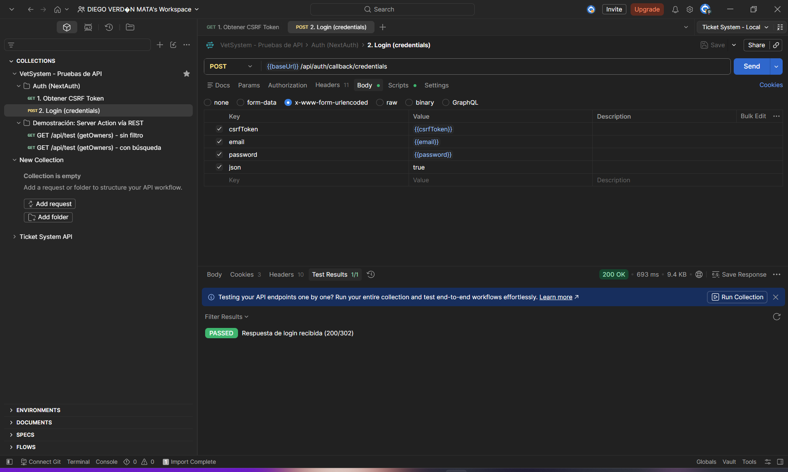
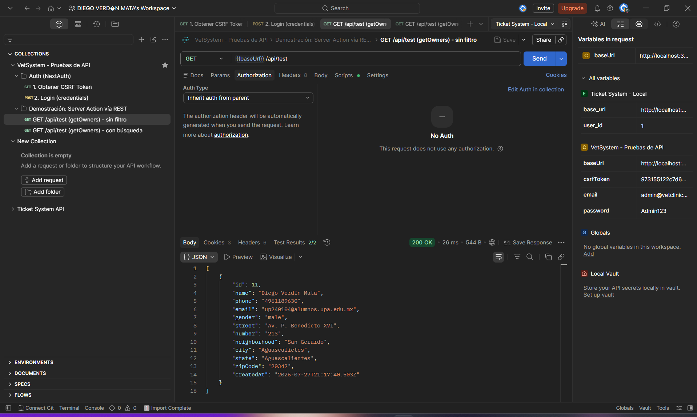
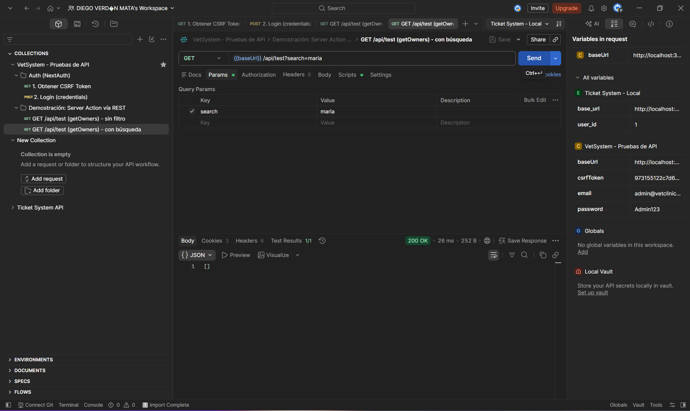

# Pruebas de API (Postman)

## Nota sobre Postman / Bruno en esta arquitectura

El CRUD de VetSystem no se ejecuta contra endpoints REST propios, sino mediante **Server Actions** (funciones de servidor invocadas directamente desde React — ver [`src/app/actions/README.md`](../src/app/actions/README.md)). Por eso el equipo no construyó una colección Postman "un endpoint por operación" como se haría en un backend Express/NestJS clásico: no existen esos endpoints en el diseño final del sistema.

Como demostración de que sí es técnicamente posible exponer esa misma lógica como API REST, se agregó una ruta adicional, fuera del diseño final del backend, que envuelve una sola Server Action (`getOwners`, de `src/app/actions/owners.ts`) en un Route Handler de Next.js:

```
GET /api/test                  # sin filtro
GET /api/test?search=maria     # usando el parámetro search de getOwners
```

Junto con esa ruta de demostración, sí se probó por completo el único endpoint HTTP real y permanente del proyecto: el login de NextAuth.

```
GET  /api/auth/csrf                      # obtiene csrfToken + cookie
POST /api/auth/callback/credentials      # login con email y password
```

## Capturas de las solicitudes HTTP

**Login (NextAuth)** — obtención del token CSRF y envío de credenciales:



**Ruta de demostración `/api/test`** — sin filtro y con el parámetro `search`:





## Colección exportada

Colección de Postman exportada en formato `.json`, con las carpetas **"Auth (NextAuth)"** y **"Demostración: Server Action vía REST"**.

**Ruta de la colección:** [`postman/VetSystem.postman_collection.json`](./VetSystem.postman_collection.json)

## Aclaración para la revisión

El resto de las operaciones (crear, leer, actualizar, eliminar dueños, mascotas, citas, historial médico, vacunas e inventario) no se probaron por esta vía porque no existen como endpoints REST; se ejecutan y se verifican desde la interfaz, mediante las Server Actions descritas en [`src/app/actions/README.md`](../src/app/actions/README.md). La ruta `/api/test` es exclusivamente una prueba de concepto para esta entrega y no forma parte del sistema en producción.
