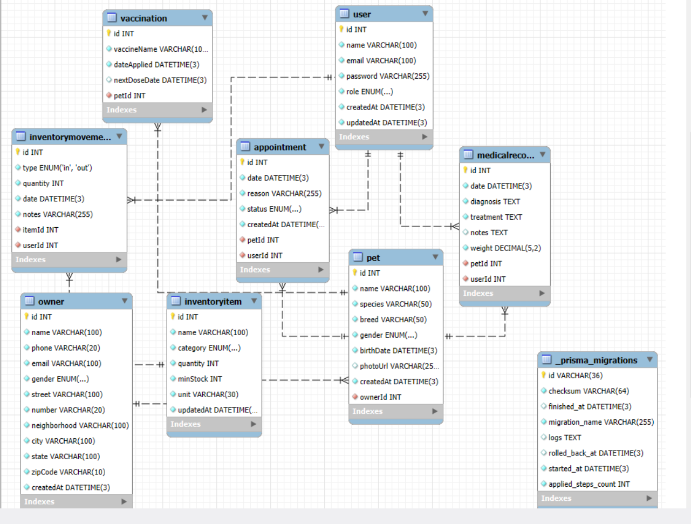

# Base de datos

Modelo de datos, scripts y notas sobre la base de datos de VetSystem. Motor: **MySQL**, gestionado con **Prisma ORM**.

## Diagrama del modelo



## Entidades y relaciones

| Modelo | Descripción | Relaciones |
|---|---|---|
| `User` | Personal de la clínica (admin/staff) que usa el sistema | 1:N con `Appointment`, `MedicalRecord`, `InventoryMovement` |
| `Owner` | Dueño de una o más mascotas | 1:N con `Pet` |
| `Pet` | Mascota registrada, pertenece a un `Owner` | N:1 con `Owner`; 1:N con `Appointment`, `MedicalRecord`, `Vaccination` |
| `MedicalRecord` | Registro de historial médico (diagnóstico, tratamiento, peso) | N:1 con `Pet` y `User` |
| `Vaccination` | Vacuna aplicada a una mascota, con fecha de próxima dosis opcional | N:1 con `Pet` |
| `Appointment` | Cita programada para una mascota, atendida por un `User` | N:1 con `Pet` y `User` |
| `InventoryItem` | Producto/insumo del inventario (médico u operacional) | 1:N con `InventoryMovement` |
| `InventoryMovement` | Entrada o salida de stock de un `InventoryItem`, registrada por un `User` | N:1 con `InventoryItem` y `User` |

Enums: `Role` (admin/staff), `OwnerGender`, `PetGender`, `AppointmentStatus` (pending/completed/cancelled), `ItemCategory` (medical/operational), `MovementType` (in/out).

El esquema completo está en [`schema.prisma`](./schema.prisma).

## Scripts de creación e inserción

Prisma maneja la creación de **tablas** mediante **migraciones versionadas** en [`prisma/migrations/`](./migrations), no con un script `.sql` suelto. Antes de eso, la **base de datos** en sí (el schema vacío en el servidor MySQL) se crea con [`prisma/create-db.ts`](./create-db.ts):

```bash
npm run db:create              # solo crea la base de datos vacía
npm run db:create -- --migrate # la crea y aplica las migraciones en un solo paso
```

Este script lee `DATABASE_URL` desde `.env`, extrae host/puerto/usuario/contraseña/nombre de base con el parser nativo `URL` de Node, y ejecuta `CREATE DATABASE IF NOT EXISTS` a través del cliente `mysql` de línea de comandos.

Para aplicar las migraciones (crear las tablas) sobre una base de datos ya existente:

```bash
npx prisma migrate deploy
```

| Migración | Contenido |
|---|---|
| `20260517090039_init` | Creación de todas las tablas base del modelo (`User`, `Owner`, `Pet`, `MedicalRecord`, `Vaccination`, `Appointment`, `InventoryItem`, `InventoryMovement`) y sus enums |
| `20260530091638_vaccination_next_dose_optional` | Ajuste de `Vaccination.nextDoseDate` a opcional |

Cada carpeta de migración contiene su `migration.sql` con el DDL exacto ejecutado (`CREATE TABLE`, `ALTER TABLE`, llaves foráneas, etc.), generado y versionado automáticamente por Prisma.

### Inserción de datos

No hay un seed de datos de ejemplo activo en este momento (`prisma/seed.ts` fue removido; ver nota en el README raíz). La inserción de registros ocurre en tiempo de ejecución mediante:

- [`prisma/ensure-admin.ts`](./ensure-admin.ts): crea automáticamente un usuario `admin` por defecto si la tabla `User` está vacía (se ejecuta con `npm start`).
- Los formularios del sistema (dueños, mascotas, citas, inventario, etc.), que internamente llaman a `prisma.<modelo>.create(...)` desde los Server Actions en `src/app/actions/`.

### Reset de la base de datos

```bash
npm run db:reset
```

Ejecuta [`prisma/reset.ts`](./reset.ts), que borra todos los registros de todas las tablas (pide confirmación escrita salvo que se use `--force`).

## Consultas relevantes sobre relaciones

Dos ejemplos de consultas que combinan varias tablas (hay más en `src/app/actions/README.md`):

1. **Alertas de stock bajo por categoría** (`src/app/actions/statistics.ts`, `getLowStockByCategory`): compara `quantity` contra `minStock` dentro de `InventoryItem` y agrupa el resultado por `category`, para saber qué tan crítico está el abasto médico vs. operacional.
2. **Top de dueños con más mascotas** (`src/app/actions/statistics.ts`, `getTopOwnersByPets`): hace `JOIN` implícito entre `Owner` y `Pet` contando cuántas mascotas tiene cada dueño (`orderBy` sobre el conteo de la relación), para identificar a los clientes más frecuentes.

## Notas

- `quantity <= minStock` no se puede expresar como filtro directo de Prisma (compara dos columnas entre sí), así que esa condición específica usa `$queryRaw` en vez del query builder normal. Se usa en el dashboard y en estadísticas.
- El campo `diagnosis` de `MedicalRecord` es `@db.Text`; se agrupa igual con `groupBy` para el reporte de diagnósticos más frecuentes, sin necesidad de índice.
