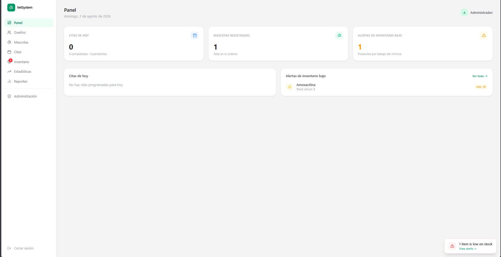
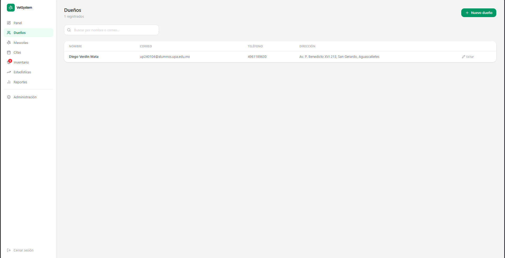
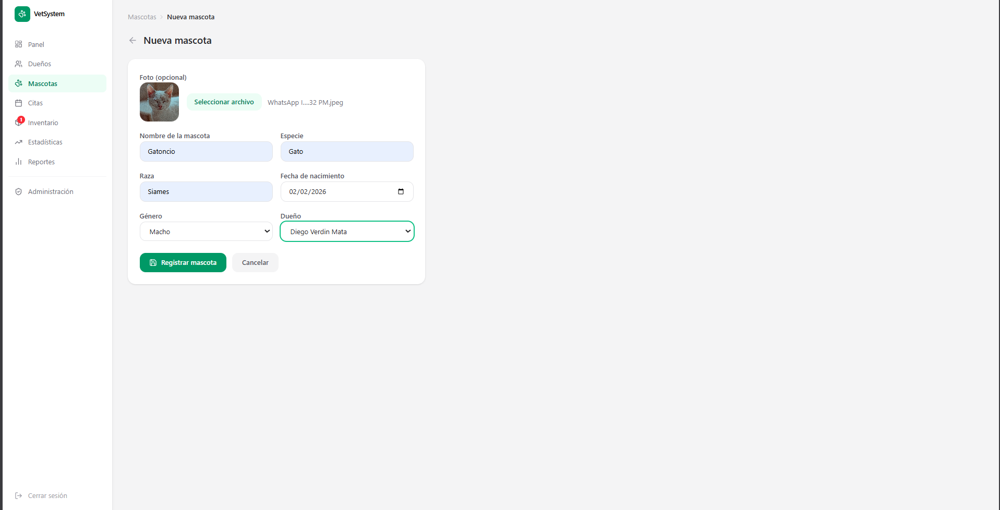
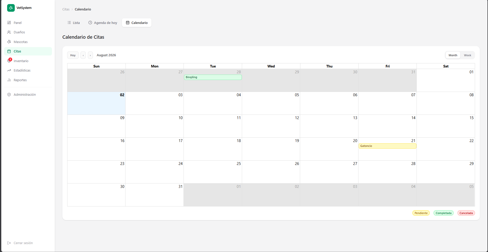
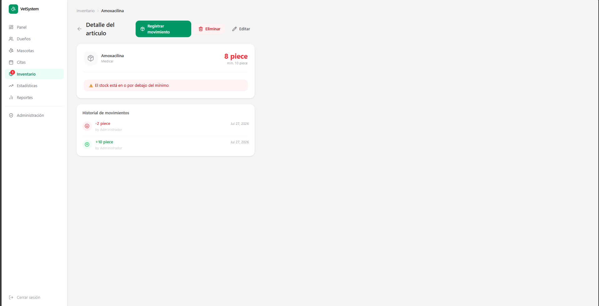
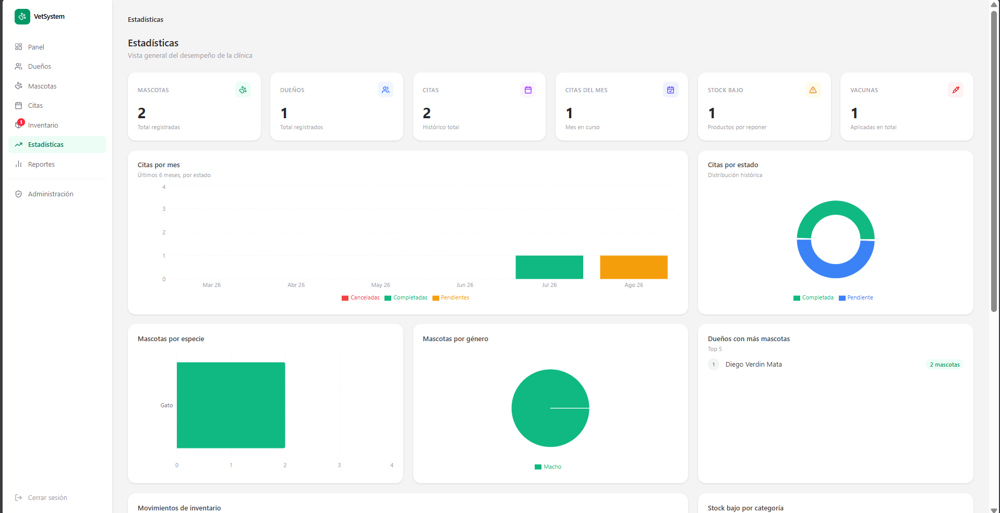
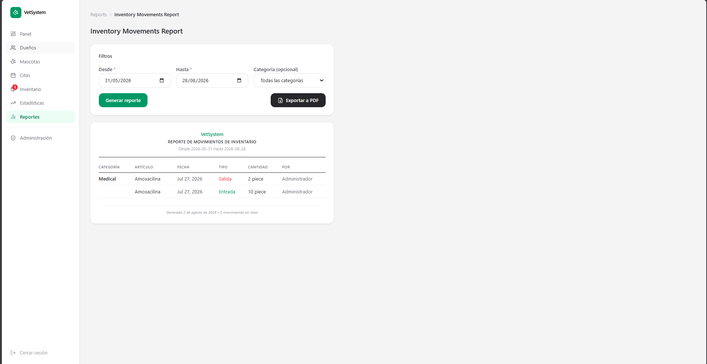

# Frontend

Interfaz web de VetSystem, construida con **Next.js 16 (App Router)** y **React 19**. No es una SPA separada del backend: las páginas son Server Components que llaman directo a los Server Actions de `src/app/actions/` (ver [`src/app/actions/README.md`](../actions/README.md)).

## Ejecución

```bash
npm install
npx prisma migrate deploy
npm run dev
```

Abrir [http://localhost:3000](http://localhost:3000). Redirige a `/login` si no hay sesión activa.

## Capturas de pantalla

**Panel principal (dashboard)** — KPIs del día y alertas de stock bajo:



**Dueños** — listado con búsqueda:



**Nueva mascota** — formulario de registro:



**Citas** — vista de calendario:



**Inventario** — detalle de artículo y alerta de stock bajo:



**Estadísticas** — gráficas del módulo avanzado:



**Reportes** — exportación filtrable a PDF:



> Ajusten las rutas de las imágenes de arriba si mueven las capturas a otra carpeta — están pensadas para vivir en `docs/` en la raíz del repo.

## Librerías usadas en el frontend

| Librería | Uso |
|---|---|
| Next.js 16 / React 19 | Framework y renderizado (App Router, Server + Client Components) |
| Tailwind CSS 4 | Estilos utilitarios |
| shadcn/ui + `@base-ui/react` | Componentes base (botones, inputs, cards) |
| `lucide-react` | Iconografía |
| `recharts` | Gráficas del módulo de Estadísticas |
| `react-big-calendar` | Vista de calendario en el módulo de Citas |
| `react-hot-toast` | Notificaciones tipo toast |
| `date-fns` | Formateo y manejo de fechas |
| `use-debounce` | Debounce en buscadores (dueños, mascotas, inventario) |
| `next-auth/react` | Hooks de sesión en el cliente (`signOut`, etc.) |
| `file-saver` | Descarga de archivos generados (PDFs) en el navegador |

## Estructura de rutas

```
src/app/
├── layout.tsx                 # Layout raíz
├── page.tsx                   # Redirección inicial
├── login/                     # Pantalla de acceso
├── api/auth/                  # Rutas de NextAuth
└── (dashboard)/                # Rutas protegidas por sesión (src/middleware.ts)
    ├── layout.tsx              # Sidebar + shell del dashboard
    ├── dashboard/               # Panel principal (KPIs del día, alertas)
    ├── owners/                  # CRUD de dueños
    ├── pets/                    # CRUD de mascotas, historial médico, vacunas
    ├── appointments/            # CRUD de citas + vista de calendario
    ├── inventory/                # CRUD de inventario, movimientos, alertas de stock
    ├── statistics/               # Estadísticas y gráficas (funcionalidad avanzada)
    ├── reports/                  # Reportes filtrables exportables a PDF
    └── admin/                    # Gestión de usuarios (solo rol admin)
```

Cada módulo sigue el mismo patrón: un `page.tsx` como Server Component que hace el fetch inicial de datos con Prisma/Server Actions, y (cuando hay interactividad) un `client.tsx` con `"use client"` para formularios, filtros y estado local.

## Componentes compartidos

`src/components/`: `sidebar.tsx` (navegación principal, con badge de alertas de stock), `breadcrumb.tsx`, `search-input.tsx` (buscador con debounce), `delete-button.tsx` / `cancel-button.tsx` (acciones con confirmación), `form-error.tsx`, y primitivos de UI en `src/components/ui/` (`button`, `card`, `input`, `label`).

## Control de acceso en la interfaz

`src/middleware.ts` protege todas las rutas bajo `(dashboard)`: sin sesión redirige a `/login`; las rutas de `/admin` están restringidas a usuarios con rol `admin` (el link correspondiente en el sidebar tampoco se muestra a `staff`).

## Notas

- El módulo de **Estadísticas** es completamente responsivo a los datos reales de la base: si no hay registros en algún periodo, cada gráfica muestra un estado vacío en vez de romperse.
- Las fotos de mascota se sirven desde `public/uploads/` (ver README raíz).
